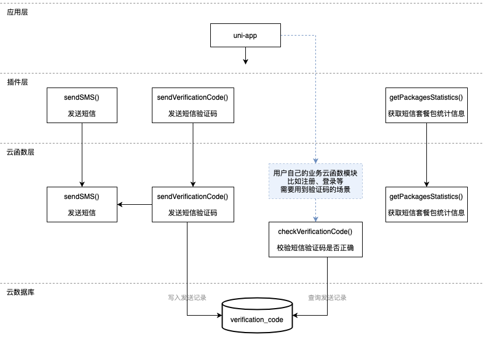

# 腾讯云短信（SMS）插件

## 1. 插件介绍
| 标题      | 名称    |
| ----     | ---------------- |
| 中文名称   | 腾讯云短信（SMS）插件 |
| 英文名称   | tencentcloud-plugin-sms |
| 最新版本   | v1.0.0 (2020.07.22) |
| 适用平台   | [DCloud uni-app](https://uniapp.dcloud.net.cn) |
| 适用产品   | [腾讯云短信（SMS）](https://cloud.tencent.com/product/sms) |
| GitHub项目| [tencentcloud-uniapp-plugin-sms](https://github.com/Tencent-Cloud-Plugins/tencentcloud-uniapp-plugin-sms) |
| 主创团队   | 腾讯云中小企业产品中心（SMB Product Center of Tencent Cloud） |

一款帮助开发者在uni-app项目开发中快捷使用腾讯云短信（SMS）产品功能的插件。

## 2. 功能特性

- 发送（群发）短信
- 发送短信验证码，并提供后续业务场景中的验证码校验功能
- 获取腾讯云短信用户套餐包的统计信息

## 3. 安装指引

本插件需要调用uniCloud云函数，而使用云函数的前提是：

- 使用DCloud官方开发工具HBuilderX 2.7+；
- 已注册DCloud开发者账号并通过实名认证；
- 开通了uniCloud并创建一个腾讯云的服务空间；

### 3.1. 新建或打开已有项目

1. 打开HBuilderX开发工具；
1. 新建或打开一个uni-app项目；

### 3.2. 导入云函数

1. 访问 DCloud 插件市场的 [腾讯云插件 - 云函数模板](https://ext.dcloud.net.cn/plugin?id=2139) 详情页；
2. 点击详情页右上角 **使用 HBuilderX 导入插件**，将云函数模板导入到您的项目中；

3. 在项目中打开 _cloudfunctions/tencentcloud-plugin/config.js_ 文件，将腾讯云的密钥信息配置进去，可以在腾讯云 [API 密钥管理](https://console.cloud.tencent.com/cam/capi) 中获取 SecretId、SecretKey 和 APPID；

4. 在[uniCloud控制台](https://unicloud.dcloud.net.cn/login)注册HBuild账号并登录，创建[云服务空间](https://uniapp.dcloud.net.cn/uniCloud/concepts/space)；

5. 绑定云函数的云服务空间，将[云函数](https://uniapp.dcloud.net.cn/uniCloud/concepts/cloudfunction) [**上传部署**](https://uniapp.dcloud.net.cn/uniCloud/quickstart?id=rundebug) 到您的[云服务空间](https://uniapp.dcloud.net.cn/uniCloud/concepts/space)；


> 如果您之前在使用其它腾讯云产品的 uni-app 插件时已经导入过此云函数模板，则前 4 个步骤可以省略。

> 若导入失败或有其它疑问，请查看 [uniCloud帮助文档](https://uniapp.dcloud.io/uniCloud/README) 云函数相关章节。

### 3.3. 导入插件

1. 访问DCloud插件市场 [腾讯云短信（SMS）插件](https://ext.dcloud.net.cn/plugin?id=2361) 详情页；
1. 点击详情页右上角 **使用HBuilderX导入插件** ，将插件导入到您的项目中；
1. 在项目中通过 import 语法将插件提供的方法导入到相关业务组件并使用；

> 本插件的默认导入位置是在您项目的“js_sdk”目录下

## 4. 使用指引

### 4.1. 插件API导图



### 4.2. 插件使用示例

```javascript
// 发送短信使用示例

import sendSMS from '@/js_sdk/tencentcloud-plugin-sms/send-sms.js';

export default {
  methods: {
    async eventHandler() {
      try {
        const phoneNumbers = ['+86155****1234'];
        const templateId = '12**34'; // 在腾讯云短信控制台申请
        const templateParams = ['动态填充内容'];
        const { SendStatusSet } = await sendSMS(phoneNumbers, templateIds, templateParams);
      } catch (error) {
        console.log(error);
      }
    }
  }
};
```

```javascript
// 发送短信验证码使用示例

import sendVerificationCode from '@/js_sdk/tencentcloud-plugin-sms/send-verification-code.js';

export default {
  methods: {
    async eventHandler() {
      try {
        const phoneNumber = '+86155****1234';
        await sendVerificationCode(phoneNumber);
      } catch (error) {
        console.log(error);
      }
    }
  }
};
```

### 4.3. 名词解释

服务空间：一个服务空间对应一整套独立的云开发资源，包括数据库、存储空间、云函数等资源。服务空间之间彼此隔离。更多详情请访问 [uniCloud开发文档](https://uniapp.dcloud.io/uniCloud/concepts/space)

云函数：云函数是运行在云端的JavaScript代码，更多详情请见 [uniCloud云函数文档](https://uniapp.dcloud.io/uniCloud/cf-functions)

## 5. 获取入口

| 插件入口      | 链接    |
| ----     | ---------------- |
| DCloud插件市场 | [腾讯云短信（SMS）插件](https://ext.dcloud.net.cn/plugin?id=2361) |

## 6. GitHub版本迭代记录

### 6.1. tencentcloud-uniapp-plugin-sms v1.0.0

- 新增发送短信功能
- 新增发送短信验证码及校验验证码功能
- 新增获取腾讯云SMS短信产品用户套餐包统计信息功能

## 7. 联系我们

&nbsp;&nbsp;&nbsp;扫码备注“春雨”来联络到我们</br>
